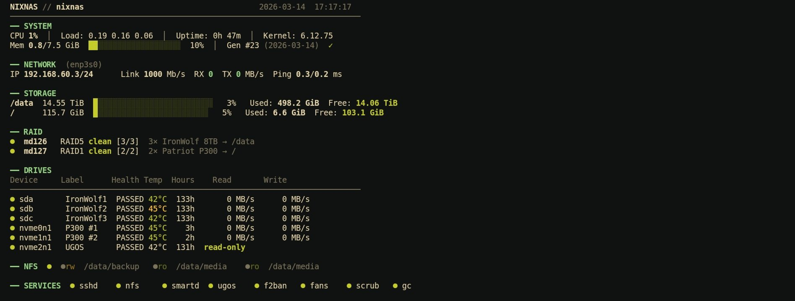

# NixOS NAS on a Ugreen DXP4800 Plus


I wanted a NAS that I actually understand. No proprietary OS, no clicking through web UIs, no mystery services running in the background. Just a plain NixOS system where every single thing is declared in config files I can read, version, and rebuild from scratch in minutes.

This repo contains the complete NixOS configuration for my home NAS — a Ugreen DXP4800 running a 512GB NVMe for the OS and apps, and a 14TB WD Purple Pro for media storage.

<p align="center">
  
  <br>
  <em>sudo nixnas-status — live system dashboard over SSH</em>
</p>

## Hardware

| | |
|-|-|
| **Device** | Ugreen DXP4800 Plus (4-Bay) |
| **CPU** | Intel Pentium Gold 8505 (5C/6T) |
| **RAM** | 8 GB DDR5 |
| **OS + Apps** | ADATA LEGEND 900 512GB NVMe → ext4, partitioned |
| **Data** | WD Purple Pro 14TB (WD141PURP) → btrfs + zstd:1 |
| **Network** | 2.5GbE (+ unused 10GbE) |

## What's In Here

The entire system is ~8 files. Here's what they set up:

**Storage** — disko handles partitioning declaratively. The NVMe is split into three partitions: EFI/boot (1GB), NixOS root (64GB), and `/apps` (remaining ~447GB) for Docker data and configs. The BIOS boots directly from the ADATA NVMe ESP. The 14TB HDD is a single btrfs partition mounted at `/data` with zstd compression and a monthly scrub for integrity.

**Docker** — Docker daemon runs with `data-root` pointed at `/apps/docker` on the NVMe. Compose files and app configs live under `/apps/compose` and `/apps/config`. Media referenced by containers (e.g. Jellyfin) is mounted from `/data/media` on the HDD.

**NFS** — Two shares: one read-write for Proxmox backups (no_root_squash), one read-only for Jellyfin media streaming.

**Health** — smartmontools runs short self-tests daily and long tests weekly, with temperature alerts at 45/55°C. hdparm puts the HDD to sleep after 20 min idle and enables quiet seek mode to reduce noise.

**Security** — Fail2Ban on SSH (5 attempts → 1h ban, escalating to 48h). Firewall open only for SSH and NFS.

**Fan Control** — The DXP4800 Plus uses an ITE IT8613E chip that the mainline kernel doesn't support yet. This config builds the out-of-tree it87 module from source, loads it with `force_id=0x8613`, and a systemd service sets all fans to automatic mode on boot. Quiet at idle, ramps up under load.

**UGOS Protection** — The DXP4800 ships with Ugreen's proprietary OS on an internal NVMe SSD. I keep it intact for warranty. Four independent layers make sure it's never written to: excluded from disko, udev sets it read-only by serial, a systemd service re-applies on boot, and there are no mount entries. Restoring UGOS is just a BIOS boot order change.

## Dashboard

Building a full web interface for a NAS felt like overkill — and kind of against the whole point of running a minimal NixOS system. Instead there's `nixnas-status`, a ~350 line bash script that gives you a live overview of everything that matters, right in your terminal over SSH.

It shows system stats, network, storage with usage bars, all drives with SMART status and temperatures, NFS share status, and all services at a glance. Updates every 5 seconds without flickering (cursor repositioning instead of clear). Runs as `sudo nixnas-status`.

The script is bundled into the NixOS config via `writeShellScriptBin` — no extra installation, it's just there after a rebuild.

## Files

```
flake.nix                   # nixpkgs 25.11 + disko
configuration.nix           # boot, network, users, packages, services, Docker
disko-config.nix            # NVMe partition layout + HDD btrfs layout
hardware-configuration.nix  # kernel modules, CPU, firmware
modules/nfs.nix             # NFS exports
modules/ugos-protection.nix # 4-layer UGOS SSD protection
modules/fan-control.nix     # ITE IT8613E out-of-tree driver + auto fan curve
scripts/nixnas-status        # live SSH dashboard
```

## Storage Layout

```
NVMe (OS + Apps) ─ ADATA LEGEND 900 512GB
├── nvme0n1p1  → /boot       (vfat, 1GB, EFI)
├── nvme0n1p2  → /           (ext4, 64GB, NixOS root + Nix store)
└── nvme0n1p3  → /apps       (ext4, ~447GB, Docker data + compose + configs)
    ├── docker/              (Docker data-root)
    ├── compose/             (docker-compose files)
    └── config/              (app config files)

HDD (Media) ─ WD Purple Pro 14TB
└── sda1       → /data       (btrfs, ~14TB, compress=zstd:1)
    ├── media/               (Anime, Filme, Serien, Musik)
    ├── incoming/            (download staging)
    └── backup/              (Proxmox backups)

UGOS SSD ─ internal NVMe  (READ-ONLY)
→ Original Ugreen OS, protected for warranty
→ Shared ESP hosts NixOS + UGOS bootloaders
```

## Reproducing This

You'll need a Ugreen DXP4800 Plus with an NVMe and HDD. Confirm your HDD device ID matches `disko-config.nix`:

```bash
ls /dev/disk/by-id/ | grep ata-WDC
```

Then install:

```bash
# 1. Boot NixOS minimal ISO from USB (use LTS kernel)
#    Disable WatchDog in BIOS first (it reboots after 180s expecting UGOS)

# 2. Set the UGOS SSD read-only before touching anything
blockdev --setro /dev/disk/by-id/nvme-YSO128GTLCW-E3C-2_511250811096010990

# 3. Partition drives with disko
nix --experimental-features "nix-command flakes" run github:nix-community/disko -- \
  --mode disko ./disko-config.nix

# 4. Clone this repo into /mnt/etc/nixos
git clone https://github.com/daskladas/nixnas.git /mnt/etc/nixos

# 5. Build and install (two-step workaround for a known flake bug)
nix --experimental-features "nix-command flakes" build \
  .#nixosConfigurations.nixnas.config.system.build.toplevel --store /mnt
nixos-install --root /mnt --system ./result --no-root-passwd

# 6. In BIOS, set the ADATA NVMe as the boot device
#    The NixOS ESP on /boot is already on the ADATA — no extra steps needed

# 7. Reboot, remove USB, NixOS should boot
# 8. After first login: change password with passwd
```

After first boot, any future changes are just:

```bash
cd /etc/nixos && sudo nixos-rebuild switch --flake .#nixnas
```

## Known Quirks

- **WatchDog reboots** — BIOS sends a 180s watchdog expecting UGOS to respond; disable it in BIOS settings
- **nixos-install crash** — `nix flake build` + `nixos-install --flake` hits an assertion error; the two-step build-then-install workaround above avoids it
- **IT8613E fan chip** — needs an out-of-tree `it87` kernel module; included in this config and built automatically

## License

MIT
